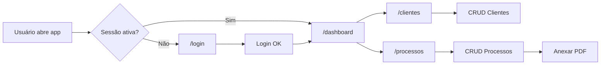

# Trigger Map: ThemisTec

> Mapeamento de gatilhos (triggers) de ação do usuário por funcionalidade.
> Cada trigger mapeia: **Quem → O quê → Onde → Resultado esperado**.

---

## EP01 – Autenticação

### T01: Acesso à Plataforma (Login)
| Campo | Valor |
|-------|-------|
| **Persona** | Advogado Autônomo |
| **Gatilho** | Usuário abre a aplicação sem sessão ativa |
| **Ação** | Preenche e-mail e senha → Clica "Entrar na plataforma" |
| **Rota** | `/login` |
| **Resultado Esperado** | Redirecionamento para `/dashboard` com sessão iniciada |
| **Resultado de Erro** | Mensagem "Falha ao entrar" com descrição do erro |

### T02: Criação de Conta (Registro)
| Campo | Valor |
|-------|-------|
| **Persona** | Advogado Autônomo (novo) |
| **Gatilho** | Clica em "crie uma nova conta grátis" na tela de login |
| **Ação** | Preenche nome, e-mail, senha e confirmação → Submete |
| **Rota** | `/register` |
| **Resultado Esperado** | Conta criada, e-mail de confirmação enviado, redirect para `/login` |
| **Resultado de Erro** | Validação inline (Zod) ou erro do Firebase exibido no formulário |

### T03: Recuperação de Senha
| Campo | Valor |
|-------|-------|
| **Persona** | Advogado Autônomo |
| **Gatilho** | Clica "Esqueceu a senha?" na tela de login |
| **Ação** | Informa e-mail → Solicita redefinição |
| **Rota** | `/reset-password` |
| **Resultado Esperado** | Link de redefinição enviado ao e-mail informado |

---

## EP02 – Gestão de Clientes

### T04: Cadastrar Novo Cliente
| Campo | Valor |
|-------|-------|
| **Persona** | Advogado Autônomo |
| **Gatilho** | Clica em "Novo Cliente" na listagem |
| **Ação** | Preenche formulário (nome*, CPF*, telefone, e-mail, endereço) → Salva |
| **Rota** | `/clientes/novo` ou modal |
| **Resultado Esperado** | Cliente salvo no Firestore, exibido na lista |
| **Validações** | CPF único e válido (algoritmo), nome obrigatório |

### T05: Buscar Cliente
| Campo | Valor |
|-------|-------|
| **Persona** | Advogado Autônomo |
| **Gatilho** | Digita no campo de busca da listagem |
| **Ação** | Pesquisa por nome ou CPF |
| **Rota** | `/clientes` |
| **Resultado Esperado** | Lista filtrada em tempo real (< 2s) |

### T06: Editar/Excluir Cliente
| Campo | Valor |
|-------|-------|
| **Persona** | Advogado Autônomo |
| **Gatilho** | Clica no ícone de editar/excluir na linha do cliente |
| **Ação (Editar)** | Formulário preenchido com dados → Atualiza |
| **Ação (Excluir)** | Modal de confirmação → Confirma exclusão |
| **Resultado Esperado** | Dado atualizado/removido do Firestore e da listagem |

---

## EP03 – Gestão de Processos

### T07: Registrar Novo Processo
| Campo | Valor |
|-------|-------|
| **Persona** | Advogado Autônomo |
| **Gatilho** | Clica em "Novo Processo" |
| **Ação** | Seleciona cliente vinculado, preenche número*, tipo*, data*, status |
| **Rota** | `/processos/novo` ou modal |
| **Resultado Esperado** | Processo salvo e vinculado ao cliente |
| **Validações** | Número do processo único, tipo e data obrigatórios |

### T08: Consultar Processos com Filtros
| Campo | Valor |
|-------|-------|
| **Persona** | Advogado Autônomo |
| **Gatilho** | Acessa a listagem de processos ou aplica filtros |
| **Ação** | Filtra por status (ativo/arquivado) e/ou por cliente |
| **Rota** | `/processos` |
| **Resultado Esperado** | Lista paginada e filtrada retornada em < 2s |

### T09: Anexar PDF ao Processo
| Campo | Valor |
|-------|-------|
| **Persona** | Advogado Autônomo |
| **Gatilho** | Clica "Anexar documento" na tela de detalhes do processo |
| **Ação** | Seleciona arquivo PDF (máx. 10MB) → Upload |
| **Rota** | `/processos/[id]` |
| **Resultado Esperado** | PDF enviado ao Firebase Storage, URL salva no Firestore |
| **Validações** | Apenas `.pdf`, máximo 10MB, limite de 5GB por usuário |

---

## Diagrama de Fluxo Geral

