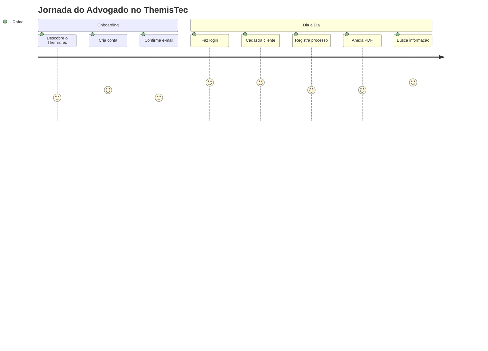

# UX Scenarios: ThemisTec

> Cenários de uso detalhados que descrevem a jornada do usuário em cada funcionalidade.
> Formato: Contexto → Ação passo a passo → Resultado → Variações.

---

## Cenário 01: Primeiro Acesso (Onboarding)

**Persona:** Dr. Rafael, 28 anos, advogado recém-formado.
**Contexto:** Rafael acabou de descobrir o ThemisTec e quer testar.

### Fluxo Principal
1. Rafael acessa `themistec.site` pelo navegador do celular.
2. É redirecionado para `/login`.
3. Clica em **"Crie uma nova conta grátis"**.
4. Na tela de registro (`/register`), preenche:
   - Nome completo
   - E-mail profissional
   - Senha (mín. 8 caracteres)
   - Confirmação de senha
5. Clica em **"Criar Conta"**.
6. Recebe e-mail de confirmação do Firebase Auth.
7. Confirma o e-mail e volta para `/login`.
8. Faz login com as credenciais recém-criadas.
9. É redirecionado para `/dashboard`.

### Variações
| Variação | Comportamento |
|----------|---------------|
| Senha fraca (< 8 chars) | Validação Zod inline: "A senha deve ter pelo menos 8 caracteres" |
| E-mail já cadastrado | Erro do Firebase: "Este e-mail já está em uso" |
| Senhas não conferem | Validação Zod inline: "As senhas não conferem" |

---

## Cenário 02: Login Diário

**Persona:** Dr. Rafael
**Contexto:** Rafael abre o app toda manhã para verificar seus processos.

### Fluxo Principal
1. Abre `themistec.site`.
2. É direcionado para `/login` (sessão expirada).
3. Digita e-mail e senha.
4. Clica em **"Entrar na plataforma"**.
5. Vê o spinner de loading no botão.
6. É redirecionado para `/dashboard` em < 2 segundos.

### Variações
| Variação | Comportamento |
|----------|---------------|
| Senha incorreta | Alerta vermelho: "E-mail ou senha inválidos" |
| Esqueceu a senha | Clica "Esqueceu a senha?" → `/reset-password` → recebe link por e-mail |
| Sessão ainda ativa | Redireciona direto para `/dashboard` sem pedir login |

---

## Cenário 03: Cadastro de Novo Cliente

**Persona:** Dr. Rafael
**Contexto:** Um novo cliente acabou de contratar Rafael para um caso trabalhista.

### Fluxo Principal
1. Na tela de `/clientes`, clica em **"Novo Cliente"**.
2. Formulário abre com os campos:
   - Nome completo* (obrigatório)
   - CPF* (obrigatório, validado)
   - Telefone
   - E-mail
   - Endereço
3. Preenche os dados do cliente.
4. CPF é validado em tempo real (algoritmo + unicidade).
5. Clica em **"Salvar"**.
6. Cliente aparece na listagem com feedback visual (toast de sucesso).

### Variações
| Variação | Comportamento |
|----------|---------------|
| CPF inválido | Validação inline: "CPF inválido" |
| CPF já cadastrado | Erro: "Já existe um cliente com este CPF" |
| Campos obrigatórios vazios | Campos destacados em vermelho com mensagens de erro |

---

## Cenário 04: Busca Rápida de Cliente

**Persona:** Dr. Rafael
**Contexto:** Rafael está no telefone com um cliente e precisa achar os dados dele rapidamente.

### Fluxo Principal
1. Na tela `/clientes`, foca no campo de **busca**.
2. Digita parte do nome ("Mar") ou do CPF ("123").
3. A lista filtra em tempo real conforme digita.
4. Encontra o cliente em **menos de 10 segundos**.
5. Clica no nome para ver os detalhes.

### Critério de Sucesso
> O advogado deve encontrar qualquer informação de cliente/processo em **menos de 10 segundos** (conforme PRD, Persona Primária).

---

## Cenário 05: Registrar um Novo Processo

**Persona:** Dr. Rafael
**Contexto:** Rafael precisa registrar o processo trabalhista do novo cliente.

### Fluxo Principal
1. Na tela `/processos`, clica em **"Novo Processo"**.
2. Formulário exibe os campos:
   - Cliente vinculado* (dropdown de busca)
   - Número do processo* (único)
   - Tipo* (Trabalhista, Cível, Criminal, etc.)
   - Data de abertura*
   - Status (Ativo, Em andamento, Arquivado)
   - Observações
3. Seleciona o cliente cadastrado anteriormente.
4. Preenche os dados do processo.
5. Clica em **"Salvar"**.
6. Processo aparece na listagem vinculado ao cliente.

### Variações
| Variação | Comportamento |
|----------|---------------|
| Número de processo duplicado | Erro: "Este número de processo já está cadastrado" |
| Cliente não encontrado | Sugestão para cadastrar novo cliente primeiro |

---

## Cenário 06: Anexar Documento ao Processo

**Persona:** Dr. Rafael
**Contexto:** Rafael recebeu a petição inicial em PDF e precisa anexar ao processo.

### Fluxo Principal
1. Na tela de detalhes do processo (`/processos/[id]`), clica em **"Anexar Documento"**.
2. Seleciona o arquivo PDF do dispositivo.
3. Barra de progresso indica o upload.
4. Arquivo é enviado ao Firebase Storage.
5. URL do arquivo é salva no documento Firestore do processo.
6. Documento aparece na lista de anexos com nome e data.

### Variações
| Variação | Comportamento |
|----------|---------------|
| Arquivo > 10MB | Erro: "O arquivo deve ter no máximo 10MB" |
| Arquivo não é PDF | Erro: "Apenas arquivos PDF são permitidos" |
| Limite de 5GB atingido | Erro: "Você atingiu o limite de armazenamento" |

---

## Cenário 07: Consulta com Filtros

**Persona:** Dr. Rafael
**Contexto:** Rafael quer ver apenas os processos ativos do cliente "Maria Silva".

### Fluxo Principal
1. Na tela `/processos`, aplica o filtro de **Status: "Ativo"**.
2. Aplica o filtro de **Cliente: "Maria Silva"**.
3. A lista é atualizada mostrando apenas os processos que atendem ambos filtros.
4. Resultados retornam em **< 2 segundos**.

---

## Mapa de Jornada Resumido

