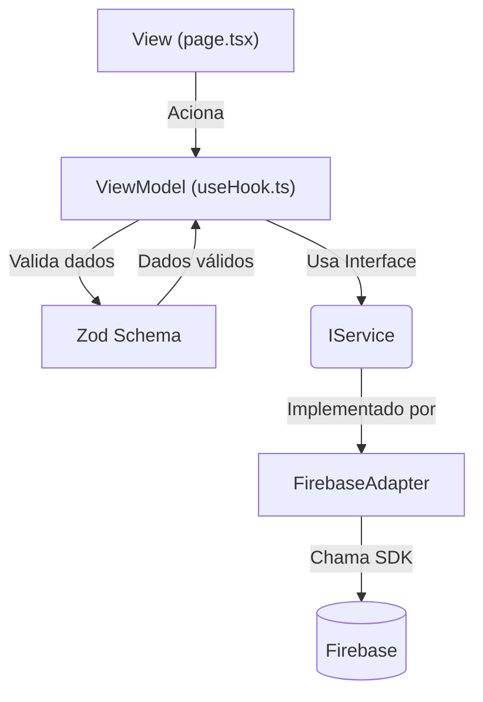

# Development Guide: ThemisTec

> Guia técnico de desenvolvimento para o time do ThemisTec.
> Cobre arquitetura, convenções de código, fluxo de trabalho e comandos essenciais.

---

## Stack Tecnológica

| Camada | Tecnologia | Versão |
|--------|-----------|--------|
| Framework | Next.js (App Router) | 15.x / 16.x |
| Linguagem | TypeScript (strict) | 5.x |
| Estilização | Tailwind CSS | 3.x / 4.x |
| Autenticação | Firebase Auth | 11.x |
| Banco de Dados | Firebase Firestore | — |
| Armazenamento | Firebase Storage | — |
| Validação | Zod | 3.x |
| Formulários | React Hook Form | — |
| Hospedagem | Vercel | — |

---

## Arquitetura: MVVM + Inversão de Dependência

O projeto segue o padrão **MVVM (Model-View-ViewModel)** dentro de um **Monolito Modular**.

### Regra de Ouro
> **A View NUNCA importa o Firebase diretamente.** Todo acesso a serviços externos passa por Adapters e Interfaces.

### Camadas

```
View (page.tsx) → ViewModel (useHook.ts) → Interface (IService) → Adapter (FirebaseAdapter)
```

| Camada | Localização | Responsabilidade |
|--------|-------------|-----------------|
| **View** | `src/app/**/page.tsx` | Renderização visual, formulários, feedback |
| **ViewModel** | `src/app/**/use*.ts` | Lógica de estado, validação (Zod), chamadas ao Model |
| **Model (Interface)** | `src/shared/interfaces/` | Contratos de serviço (`IAuthService`, etc.) |
| **Model (Adapter)** | `src/services/firebase/` | Implementação concreta dos contratos |

### Diagrama



---

## Estrutura de Diretórios

```
src/
├── app/                      # Next.js App Router (Views + ViewModels)
│   ├── (authenticated)/      # Rotas protegidas
│   │   ├── clientes/         # CRUD de clientes
│   │   ├── processos/        # CRUD de processos
│   │   ├── dashboard/        # Painel principal
│   │   └── layout.tsx        # Layout autenticado (com sidebar/nav)
│   ├── login/                # Tela de login
│   │   ├── page.tsx          # View
│   │   └── useLogin.ts       # ViewModel
│   ├── register/             # Tela de registro
│   ├── globals.css           # Design tokens e estilos globais
│   ├── layout.tsx            # Root layout
│   └── page.tsx              # Rota raiz (redirect)
├── components/
│   ├── layout/               # Componentes de layout (Sidebar, Header)
│   └── ui/                   # Componentes atômicos do Design System
│       ├── Button.tsx
│       ├── Input.tsx
│       └── Card.tsx
├── services/
│   ├── firebase/             # Adapters do Firebase
│   │   ├── firebase.config.ts
│   │   └── FirebaseAuthAdapter.ts
│   └── export/               # Serviço de exportação
├── shared/
│   └── interfaces/           # Contratos de inversão de dependência
├── specs/
│   └── schemas/              # Schemas Zod de validação
└── tests/                    # Testes automatizados
```

---

## Padrões de Projeto (GoF) Utilizados

| Padrão | Onde | Para quê |
|--------|------|----------|
| **Adapter** | `FirebaseAuthAdapter.ts` | Isolar SDK do Firebase das Views |
| **Singleton** | `firebase.config.ts` | Instância única do Firebase Client |
| **Observer** | Reações ao cadastro de processo | Notificar componentes dependentes |

---

## Convenções de Código

### Nomenclatura
| Elemento | Convenção | Exemplo |
|----------|-----------|---------|
| Componentes React | PascalCase | `LoginPage`, `Button` |
| Hooks | camelCase com prefixo `use` | `useLogin`, `useClientes` |
| Interfaces | PascalCase com prefixo `I` | `IAuthService` |
| Schemas Zod | PascalCase com sufixo `Schema` | `LoginSchema` |
| Tipos derivados | PascalCase com sufixo `Input`/`Output` | `LoginInput` |
| Arquivos de página | `page.tsx` (convenção Next.js) | — |
| Arquivos de ViewModel | `use[Funcionalidade].ts` | `useLogin.ts` |

### Imports
- Usar path alias `@/` (mapeia para `src/`).
- Nunca importar Firebase diretamente em Views ou ViewModels.

### CSS
- Usar classes Tailwind diretamente nos componentes.
- Tokens de design devem estar em `globals.css` como CSS variables.
- Componentes de UI em `src/components/ui/` encapsulam os estilos.

---

## Comandos Essenciais

```bash
# Desenvolvimento
npm run dev          # Inicia o servidor de desenvolvimento

# Qualidade de Código
npm run lint         # Roda ESLint
npm run typecheck    # Verifica tipagem TypeScript

# Build
npm run build        # Build de produção
npm run start        # Inicia servidor de produção

# Testes
npm run test         # Roda testes com Vitest
```

---

## Fluxo de Trabalho (Git)

1. Criar branch a partir de `develop`: `feat/nome-da-feature` ou `fix/nome-do-bug`.
2. Desenvolver seguindo a Spec correspondente em `_bmad-output/implementation-artifacts/`.
3. Rodar `npm run lint` e `npm run typecheck` antes de commitar.
4. Criar PR com `Closes #<numero-da-issue>` no corpo.
5. Solicitar review.
6. Merge após aprovação.

---

## ADRs (Architecture Decision Records)

Decisões arquiteturais importantes estão documentadas em `docs/architecture/decisions/`:

| ADR | Título |
|-----|--------|
| 0001 | Adoção de ADRs |
| 0002 | Organização do Código |
| 0003 | Stack Tecnológica do MVP |
| 0004 | Autenticação com Firebase |
| 0005 | Hospedagem e Infraestrutura |
| 0006 | Armazenamento de Arquivos |
| 0007 | Adoção do MVVM |
| 0008 | Padrões de Projeto GoF |
